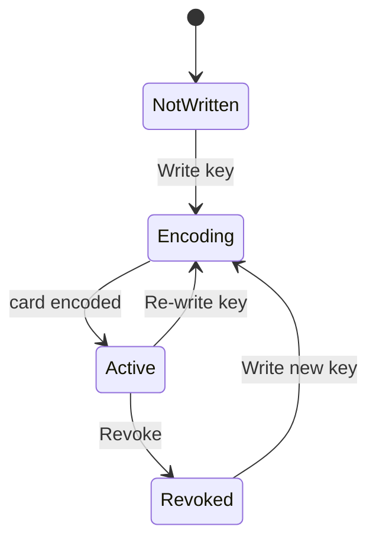

# Reservations calendar upgrade

## Context

Everything lives in the existing localStorage store, so each feature needs a matching slice in `src/lib/store.ts`, a promise wrapper in `src/lib/api.ts`, and a `Snapshot` field so `useHotelData()` re-renders.

Already in place and reused as-is: `DateRangeInput`, `AvailableRoomsModal` with its Reserve button, `TapeChart`, `ReservationDetailDialog`, and `logBookingActivity`.

## 1. Save the plan as a repo reference

Create `plan/reservations-upgrade.md` containing this plan.

## 2. Data layer

In `src/lib/types.ts`:

```ts
export type KeyCardStatus = "not_written" | "active" | "revoked";

export interface KeyCard {
  id: string;
  reservation_id: string;
  room_id: string;
  code: string;         // encoded on the card
  qr_payload: string;   // scanned at self check-in
  status: KeyCardStatus;
  write_count: number;
  written_at?: string;
  revoked_at?: string;
  created_at: string;
  updated_at: string;
}
```

Extend `BookingActivityKind` with `"room_moved" | "key_written" | "key_revoked"`.

In `src/lib/store.ts` add a `key_cards: KeyCard[]` slice (`StoreData`, `normalizeData`, `seedData`, `EMPTY_DATA`, `Snapshot`, `EMPTY_SNAPSHOT`, `getSnapshot`) plus:

- `moveReservationRoom({ id, room_id })` - rejects cancelled/checked-out stays, maintenance rooms, and overlaps with other active stays in the target room (excluding self); when the stay is `checked_in` it flips the old room to `cleaning` and the new room to `occupied`; updates `room_id`/`room_type`; logs `room_moved`; revokes any active key card since the key encodes the room.
- `listKeyCards(reservationId?)`, `writeKeyCard({ reservation_id })` (creates or re-writes: new `code`, `write_count + 1`, status `active`), `revokeKeyCard(id)`. Log `key_written` / `key_revoked`.

Mirror all four in `src/lib/api.ts`.

## 3. QR generation

Install the `qrcode` package and add `src/lib/qr.ts` wrapping `QRCode.toDataURL(payload)` so components just render an ``. Payload is a compact JSON string of reference, room number, stay dates, and key code.

## 4. Calendar (month default, status colors, availability)

In `src/app/reservations/page.tsx`: default `days` to `30` and `start` to the first of the current month; Prev/Next step a whole month.

In `src/components/calendar/TapeChart.tsx`:

- Add a `cancelled` entry to `barStyles` (muted, dashed) behind a "Show cancelled" toggle; `barsByRoom` currently filters on `isActive`, which excludes cancelled, so relax that filter when the toggle is on.
- Add a sticky "Rooms available" summary row directly under the date header showing the free-room count per day via `availableRoomsForDates(rooms, reservations, date, addDays(date, 1)).length` from `src/lib/metrics.ts`, colour-coded when a day is sold out.
- Extend the page legend to cover all four statuses.

## 5. Two search panels above the calendar

Today one `FilterPanel` submit both filters the calendar and opens the availability modal, which is confusing. Split it:

- Find available rooms: stay dates (`DateRangeInput`) plus room type, submitting opens `AvailableRoomsModal`, whose existing Reserve button prefills the offline booking form.
- Find booking: booking code and guest last name, submitting filters the calendar through `filterReservations` and shows a compact results strip; clicking a result opens the detail modal. Keep status/source/date-type selects here.

## 6. Move room

New `src/components/reservations/MoveRoomDialog.tsx`: lists rooms free for the stay dates (`availableRoomsForDates`, self excluded), shows a rate difference hint, and calls `api.moveReservationRoom`. Opened from a "Move room" button in the detail modal footer.

## 7. Key card encoder with QR

New `src/components/reservations/KeyCardDialog.tsx` implementing the mock encoder states:



`Encoding` is a short simulated delay with an "Insert card into encoder" state. `Active` shows the key code, the QR image, room, and stay dates. After a booking is created the page offers "Encode key card"; the same dialog is reachable from a Key card tab in the detail modal.

## 8. Booking detail modal

In `src/components/reservations/ReservationDetailDialog.tsx`: add a booking-source badge (Agoda, Booking.com, Direct, Offline) next to the status badge, add a "Key card" tab, add the "Move room" footer button, and put a confirm step in front of the existing "Cancel booking" action.

## Verification

Run `npx tsc --noEmit` and `npm run lint`, then walk the flow: search a date range, reserve a room, encode a key card, move the room (key auto-revokes), find the booking by code, and cancel it.
